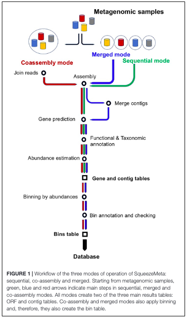
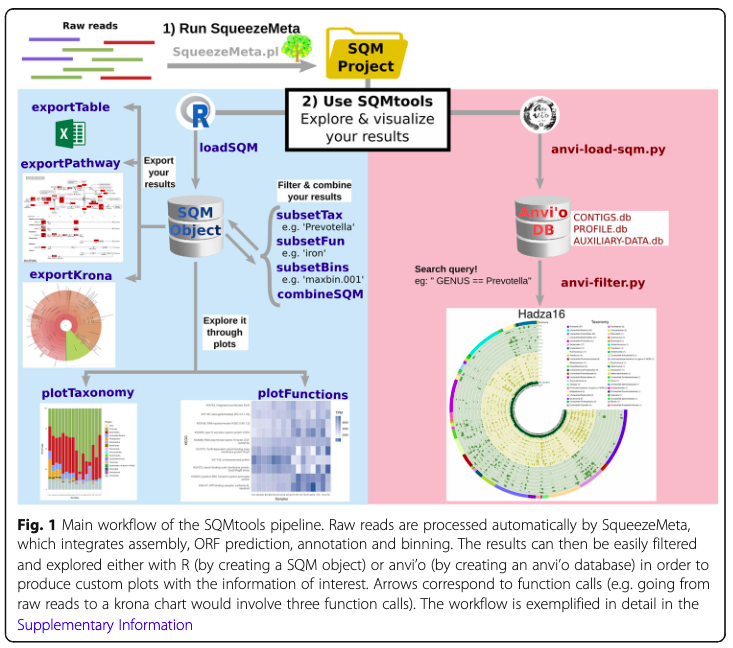
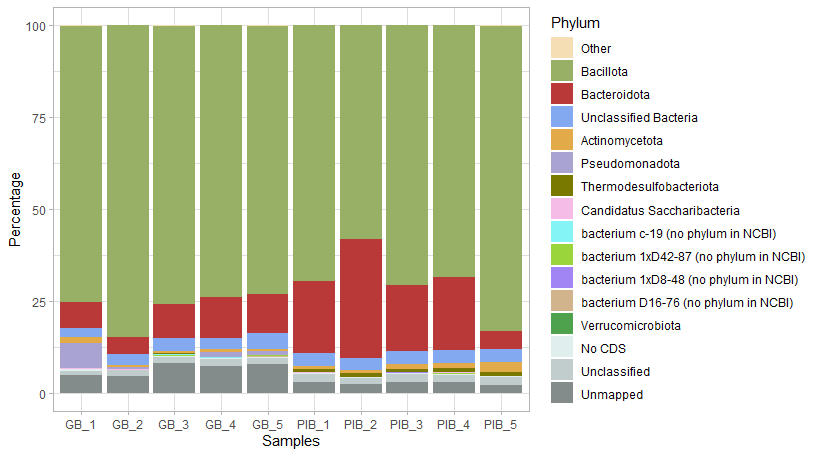
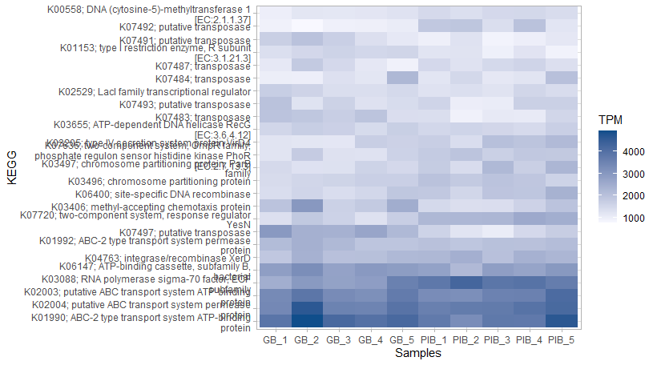

## SqueezeMeta

SqueezeMeta is a pipeline (workflow) for the analysis of shotgun metagenomics focus on bacteria ([Manual](https://github.com/jtamames/SqueezeMeta)). It performs all the required steps: quality filtering, assembly, taxonomic classification, contig binning, gene prediction and annotation, functional classifications, etc. For each step SqueezeMeta offers several options. For instance, in the assembly step you can use SPAdes or Megahit, or in the quality filtering it is possible to use Trimmomatic or Prinseq. 



> Tamames J, Puente-Sánchez F. SqueezeMeta, A Highly Portable, Fully Automatic Metagenomic Analysis Pipeline. Front Microbiol. 2018;9: 3349.

### Installation

```bash
conda create -n SqueezeMeta -y
conda activate SqueezeMeta
conda install -c conda-forge -c bioconda -c anaconda -c fpusan  squeezemeta=1.6 --no-channel-priority -y
conda deactivate
```


```bash
# Installation std output
Krona installed.  You still need to manually update the taxonomy
databases before Krona can generate taxonomic reports.  The update
script is ktUpdateTaxonomy.sh.  The default location for storing
taxonomic databases is /home/meg1/miniconda3/envs/squeezemeta/opt/krona/taxonomy

If you would like the taxonomic data stored elsewhere, simply replace
this directory with a symlink.  For example:

rm -rf /home/meg1/miniconda3/envs/squeezemeta/opt/krona/taxonomy
mkdir /path/on/big/disk/taxonomy
ln -s /path/on/big/disk/taxonomy /home/meg1/miniconda3/envs/squeezemeta/opt/krona/taxonomy
ktUpdateTaxonomy.sh
```

### Download database

```bash
conda activate SqueezeMeta 
download_databases.pl /scratch/rastrojo/squeezemetadb
conda deactivate

# Database size is around 500Gb, so it will take a while
```

```bash
# Database download testing
Testing environment...
Scalar value @args[-1] better written as $args[-1] at /lustre/proyectos/microbioma/rastrojo/miniconda3/envs/SqueezeMeta/SqueezeMeta/utils/install_utils/test_install.pl line 208.

Checking the OS
        linux OK

Checking that tree is installed
        tree --help OK

Checking that ruby is installed
        ruby -h OK

Checking that java is installed
        java -h OK

Checking that all the required perl libraries are available in this environment
        perl -e 'use Term::ANSIColor' OK
        perl -e 'use DBI' OK
        perl -e 'use DBD::SQLite::Constants' OK
        perl -e 'use Time::Seconds' OK
        perl -e 'use Tie::IxHash' OK
        perl -e 'use Linux::MemInfo' OK
        perl -e 'use Getopt::Long' OK
        perl -e 'use File::Basename' OK
        perl -e 'use DBD::SQLite' OK
        perl -e 'use Data::Dumper' OK
        perl -e 'use Cwd' OK
        perl -e 'use XML::LibXML' OK
        perl -e 'use XML::Parser' OK
        perl -e 'use Term::ANSIColor' OK

Checking that all the required python libraries are available in this environment
        python3 -h OK
        python3 -c 'import numpy' OK
        python3 -c 'import scipy' OK
        python3 -c 'import matplotlib' OK
        python3 -c 'import dendropy' OK
        python3 -c 'import pysam' OK
        python3 -c 'import Bio.Seq' OK
        python3 -c 'import pandas' OK
        python3 -c 'import sklearn' OK
        python3 -c 'import nose' OK
        python3 -c 'import cython' OK
        python3 -c 'import future' OK

Checking that all the required R libraries are available in this environment
        R -h OK
        R -e 'library(doMC)' OK
        R -e 'library(ggplot2)' OK
        R -e 'library(data.table)' OK
        R -e 'library(reshape2)' OK
        R -e 'library(pathview)' OK
        R -e 'library(DASTool)' OK
        R -e 'library(SQMtools)' OK

Checking binaries
        spades.py OK
        metabat2 OK
        jgi_summarize_bam_contig_depths OK
        samtools OK
        bwa OK
sh: line 1: 105330 Segmentation fault      /lustre/proyectos/microbioma/rastrojo/miniconda3/envs/SqueezeMeta/SqueezeMeta/bin/minimap2 --version > /dev/null 2>&1
        minimap2 NOT OK
                ERROR: Error running /lustre/proyectos/microbioma/rastrojo/miniconda3/envs/SqueezeMeta/SqueezeMeta/bin/minimap2 --version
        diamond OK
        hmmsearch OK
        cd-hit-est OK
sh: line 1: 105338 Illegal instruction     (core dumped) kmer-db -h > /dev/null 2>&1
        kmer-db NOT OK
                ERROR: Error running kmer-db -h
        aragorn OK
        mothur OK

Checking that SqueezeMeta is properly configured... checking database in /lustre/scratch/rastrojo/squeezemetadb/db
        nr.db OK
        CheckM manifest OK
        LCA_tax DB OK

------------------------------------------------------------------------------

WARNING: Some SqueezeMeta dependencies could not be found in your environment or failed to execute!
        - ERROR: Error running /lustre/proyectos/microbioma/rastrojo/miniconda3/envs/SqueezeMeta/SqueezeMeta/bin/minimap2 --version
        - ERROR: Error running kmer-db -h
```

```
# Solving minimap2 error
# Install minimap2
conda install bioconda::minimap2

rm -fr /lustre/proyectos/microbioma/rastrojo/miniconda3/envs/SqueezeMeta/SqueezeMeta/bin/minimap2

ln -s /home/proyectos/microbioma/rastrojo/miniconda3/envs/SqueezeMeta/bin/minimap2
/lustre/proyectos/microbioma/rastrojo/miniconda3/envs/SqueezeMeta/SqueezeMeta/bin/
```

```
# Trying to solve kmer-db error
# Install kmer-db (ya se installa con SqueezeMeta, pero da error)
conda update kmer-db

./kmer-db
Illegal instruction (`core' generado)

# I have also tried to compile but there is a problem with the architecture of my server microprocessor that do not allow me to used kmer-db (something related with the Advanced Vector Extensions 2 (AVX2)).
```

## Data

The data for this analysis was taken from:

_Jangid A, Fukuda S, Suzuki Y, Taylor TD, Ohno H, Prakash T. Shotgun metagenomic sequencing revealed the prebiotic potential of a grain-based diet in mice. Sci Rep. 2022;12: 6748._

In this paper, the authors studied the benefial potential of a grain-based diet (GB) compared with a purified ingredients‑based (PIB) diet. The insoluble fiber content of the GB diet increases the presence of certain bacterias taxa which are considered to be more benefial for the host (in this case the mouse). They applied shotgun metagenomics to their project and used the following pipeline to process the data:


### Reads pre-processing

Aunque SqueezeMeta puede encargarse de todos loas pasos necesarios para el análisis, tras haberlo probado, he podido comprobar que el filtrado de calidad usando Trimmomatic es más lento usando SqueezeMeta que haciéndolo por separado. Por otro lado, SqueezeMeta no cuenta con el paso de decontaminación de las lecturas (en este caso para eliminar lecturas de ratón). Además, el volumen de datos que tenemos es bastante grande: 10 muestras (1.776M de lecturas todas, 436 Gb totales, que comprimidas ocupan 313G de espacio en disco). Usar este volumen de datos con SqueezeMeta requeriría un servidor/ordenador con mucha potencia (>500G de RAM, >2T de espacio en disco y al menos 64-128 cores para que no tarde demasiado). Por ello, además de realizar el filtrado de calidad fuera de SqueezeMeta y la decontaminación, también voy a realizar un subsampling de las muestras para reducir el volumen de datos. 

Para cada muestra he realizado el siguiente procedimiento:
```bash
# QF
trimmomatic.jar PE -phred33 -threads 12 GB_1_R1.fastq.gz GB_1_R2.fastq.gz \
	GB_1_R1_qf.fastq.gz GB_1_R1_qf_unpaired.fastq.gz \
	GB_1_R2_qf.fastq.gz GB_1_R2_qf_unpaired.fastq.gz \
	ILLUMINACLIP:TruSeq3-PE.fa:2:30:10 \
	LEADING:30 TRAILING:30 MINLEN:75 AVGQUAL:30

# Subsampling
seqtk sample -s 123 GB_1_R1_qf.fastq.gz 13000000 > GB_1_R1_qf.fq
seqtk sample -s 123 GB_1_R2_qf.fastq.gz 13000000 > GB_1_R2_qf.fq
gzip GB_1_R1_qf.fq
gzip GB_1_R2_qf.fq

# Decontamination from mouse reads
# Aligning to mouse genome
# Mus_musculus.GRCm39.dna.toplevel.fa.gz (Ensembl) --> bwa index -p mus Mus_musculus.GRCm39.dna.toplevel.fa
bwa mem -o GB_1.sam -t 32 mus GB_1_R1_qf.fq.gz GB_1_R2_qf.fq.gz

# Extracting pair of reads not aligned to the mouse genome (the script is available in https://github.com/ARastrojo/Metagenomics/tree/main/scripts)
extract_NOT_aligned_from_SAM.py GB_1.sam  GB_1_R%_wo_mus

#  Output:  GB_1_R1_wo_mus.fq.gz,  GB_1_R2_wo_mus.fq.gz
```

__Pre-processing results__
| Sample | Nature of Fiber                 | Pairs of reads (2x123 nt) | Pairs of reads QF | Subsampling (Seqtk) | Decontaminated  |
|--------|---------------------------------|---------------------------|-------------------|---------------------|-----------------|
| GB_1   | Grain-based (GB)                |               119,618,662 | 72901269 (61%)    |          13,000,000 |  8199340 (63%)  |
| GB_2   | Grain-based (GB)                |                59,142,475 | 20987314 (35%)    |          13,000,000 |  8764903 (67%)  |
| GB_3   | Grain-based (GB)                |               112,272,894 | 13550240 (12%)    |          13,000,000 | 12938059 (100%) |
| GB_4   | Grain-based (GB)                |               120,037,416 | 22380780 (19%)    |          13,000,000 |  12769119 (98%) |
| GB_5   | Grain-based (GB)                |               216,065,634 | 55229002 (26%)    |          13,000,000 |  12828459 (99%) |
| PIB_1  | Purified ingedients-based (PIB) |               229,971,742 | 49019285 (21%)    |          13,000,000 |  11101292 (85%) |
| PIB_2  | Purified ingedients-based (PIB) |               221,248,573 | 52168839 (24%)    |          13,000,000 |  11624653 (89%) |
| PIB_3  | Purified ingedients-based (PIB) |               216,939,538 | 42639571 (20%)    |          13,000,000 |  11945164 (92%) |
| PIB_4  | Purified ingedients-based (PIB) |               239,926,913 | 50992867 (21%)    |          13,000,000 |  11952220 (92%) |
| PIB_5  | Purified ingedients-based (PIB) |               240,896,102 | 44580423 (19%)    |          13,000,000 | 12989527 (100%) |

### Running SqueezeMeta

``` bash
SqueezeMeta.pl -p diet -m coassembly -s samples_file.tsv -f raw_reads -c 500 -t 18
```

#### SQMtools (for SqueezeMeta results visualization)

[Manual](https://github.com/jtamames/SqueezeMeta/blob/master/SQMtools_1.6.3.pdf)
> Puente-Sánchez F, García-García N, Tamames J. SQMtools: automated processing and visual analysis of “omics data with R and anvi”o. BMC Bioinformatics. 2020;21: 358.

``` R
if (!require("BiocManager", quietly = TRUE))
  install.packages("BiocManager")
BiocManager::install("SQMtools")
```

- SQM tools diagram:


Create the required files to load SqueezeMeta (>v1.6.5) results into SQM tools:
```bash
conda activate SqueezeMeta
sqm2zip.py ./diet diet_sqm
conda deactivate
```

Loading SQM zip into R:
```R
# setwd("PATH")
library(SQMtools)
diet <- loadSQMlite("diet_tables", tax_mode = "allfilter")
summary(diet)
```

Taxonomy plot:
```R
plotTaxonomy(
	diet,
	rank = "phylum",
	count = "percent",
	N = 15,
	tax = NULL,
	others = TRUE,
	samples = NULL,
	nocds = "treat_separately",
	ignore_unmapped = FALSE,
	ignore_unclassified = FALSE,
	no_partial_classifications = FALSE,
	rescale = FALSE,
	color = NULL,
	base_size = 11,
	max_scale_value = NULL,
	metadata_groups = NULL
)
```


Taxonomy functions:
```R
plotFunctions(
	diet,
	fun_level = "KEGG",
	count = "tpm",
	N = 25,
	fun = NULL,
	samples = NULL,
	ignore_unmapped = TRUE,
	ignore_unclassified = TRUE,
	gradient_col = c("ghostwhite", "dodgerblue4"),
	base_size = 11,
	metadata_groups = NULL
)
```


Pathways visualizarion:
```R
# K00558 --> pathway 00270
exportPathway(
	diet,
	"00270",
	count = "tpm",
	samples = NULL,
	split_samples = FALSE,
	sample_colors = NULL,
	log_scale = FALSE,
	fold_change_groups = list(c("GB_1", "GB_2", "GB_3", "GB_4", "GB_5"), c("PIB_1", "PIB_2", "PIB_3", "PIB_4", "PIB_5")),
	fold_change_colors = c("red", "blue"),
	max_scale_value = NULL,
	color_bins = 10,
	output_suffix = "pathview"
)
```

